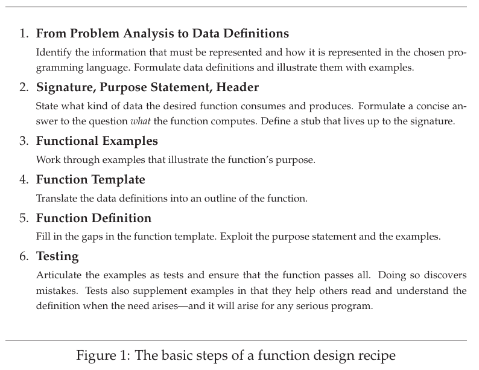
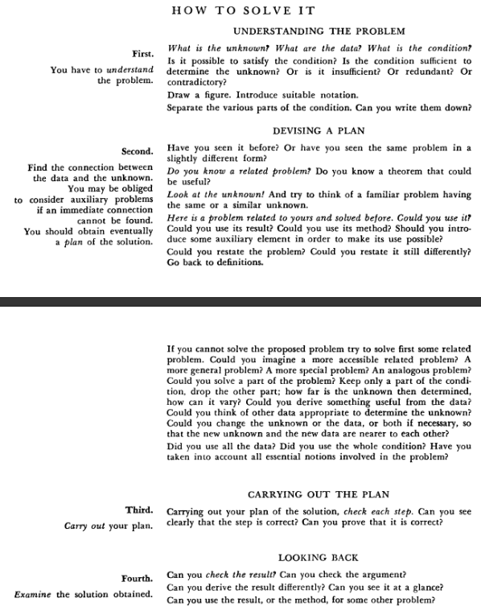
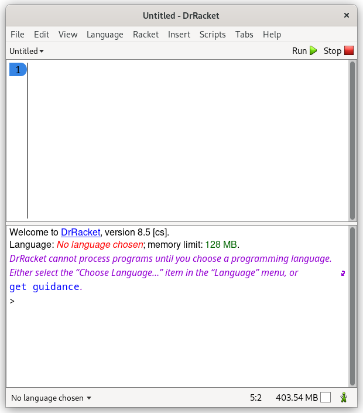

# How to Design Programs, 2nd edition

I read the Parts I and II of the book. It involves working with Beginning Student Language (BSL) in DrRacket.

The programs are collections of definitions: structure type definitions, data definitions, constant definitions, and function definitions. To guide the division of labor among functions, we follow the following rough guidelines:
  - ([chapter 3](https://htdp.org/2022-2-9/Book/part_one.html#%28part._ch~3ahtdp%29)) Design one function per task. Formulate auxiliary function definitions for every dependency between quantities in the problem.
  - ([chapter 11](https://htdp.org/2022-2-9/Book/part_two.html#%28part._sec~3acompounding2%29)) Design one template per data definition. Formulate auxiliary function definitions when one data definition points to a second data definition.
  - ([chapter 3](https://htdp.org/2022-2-9/Book/part_one.html#%28counter._.D.K._%28figure._fig~3aworld-signatures%29%29) and [chapter 11](https://htdp.org/2022-2-9/Book/part_two.html#%28part._sec~3acompounding2%29)) Maintain a *wish list* of function headers that must be designed to complete a program. Before adding a function to the wish list, check whether something like the function already exists in the programming language’s library or whether something similar is already on the wish list.
  - And don’t forget tests. 
 
Writing down complete function headers ensures that you can test those portions of the programs that you have finished, which is useful even though many tests will fail. Of course, when the wish list is empty, all tests should pass and all functions should be covered by tests. 




These recepies are similar to the one given in *How to Solve It* by Polya:



For more information, I would recommend reading [Beautiful Racket](https://beautifulracket.com/) by Matthew Butterick.

Platform: Fedora Linux 36 (Workstation Edition) with GNOME Wayland

DrRacket Installation:

`````
$ sudo ./racket-8.5-x86_64-linux-cs.sh
This program will extract and install Racket v8.5.

Note: the required diskspace for this installation is 666M.

Do you want a Unix-style distribution?
  In this distribution mode files go into different directories according
  to Unix conventions.  A "racket-uninstall" script will be generated
  to be used when you want to remove the installation.  If you say 'no',
  the whole Racket directory is kept in a single installation directory
  (movable and erasable), possibly with external links into it -- this is
  often more convenient, especially if you want to install multiple
  versions or keep it in your home directory.
Enter yes/no (default: no) > yes

Where do you want to base your installation of Racket v8.5?
  (If you've done such an installation in the past, either
   enter the same directory, or run 'racket-uninstall' manually.)
  1 - /usr/... [default]
  2 - /usr/local/...
  3 - ~/... (/root/...)
  4 - ./... (here)
  Or enter a different directory prefix to install in.
> 1

Target Directories:
  [e] Executables      /usr/bin (exists)
  [o] Libraries        /usr/lib/racket (will be created)
  [s] Shared files     /usr/share/racket (will be created)
  [c] Configuration    /usr/etc/racket (will be created)
  [d] Documentation    /usr/share/racket/doc (will be created)
  [a] .desktop files   /usr/share/applications (exists)
  [m] Man Pages        /usr/share/man (exists)
  [l] C Libraries      /usr/lib (exists)
  [h] C headers        /usr/include/racket (will be created)
  [z] Compiled at lib? yes
Enter a letter to change an entry, or enter to continue.
> 

Checking the integrity of the binary archive... ok.
Unpacking into "/usr/racket-tmp-install" (Ctrl+C to abort)...
Done.
Moving bin -> /usr/bin
Moving collects -> /usr/share/racket/collects
Moving share/pkgs -> /usr/share/racket/pkgs
Moving doc -> /usr/share/racket/doc
Moving lib -> /usr/lib/racket
Moving include -> /usr/include/racket
Moving share/applications -> /usr/share/applications
Moving share -> /usr/share/racket
Moving etc -> /usr/etc/racket
Moving man -> /usr/share/man
Moving README -> /usr/share/racket/doc/README
Writing uninstaller at: /usr/bin/racket-uninstall...
Rewriting configuration file at: /usr/etc/racket/config.rktd...
Moving "compiled" in /usr/share/racket/collects to /usr/lib/racket/compiled/usr/share/racket/collects
Moving "compiled" in /usr/share/racket/pkgs to /usr/lib/racket/compiled/usr/share/racket/pkgs
Rewriting configuration file at: /usr/etc/racket/config.rktd...

Installation complete.
$ drracket
`````



<!-----
### The basic steps of a function design recipe
1. **From Problem Analysis to Data Definitions:** Identify the information that must be represented and how it is represented in the chosen programming language. Formulate data defintions and illustrate them with examples.

2. **Signature, Purpose Statement, Header:** State what kind of data the desired function consumes and produces. Formulate a concise answer to the question *what* the function computes. Define a stub that lives up to the signature.

3. **Functional Examples:** Work through examples that illustrate the function's purpose.

4. **Function Template:** Translate the data defintions into an outline of the function.

5. **Function Definition:** Fill in the gaps in the function template. Exploit the purpose statement and the examples.

6. **Testing:** Articulate the examples as tests and ensure that the function passes all. Doing so discovers mistakes. Tests also supplement examples in that they help others read and understand the definitions when the need arises--and it will arise for any serious program.
----->
